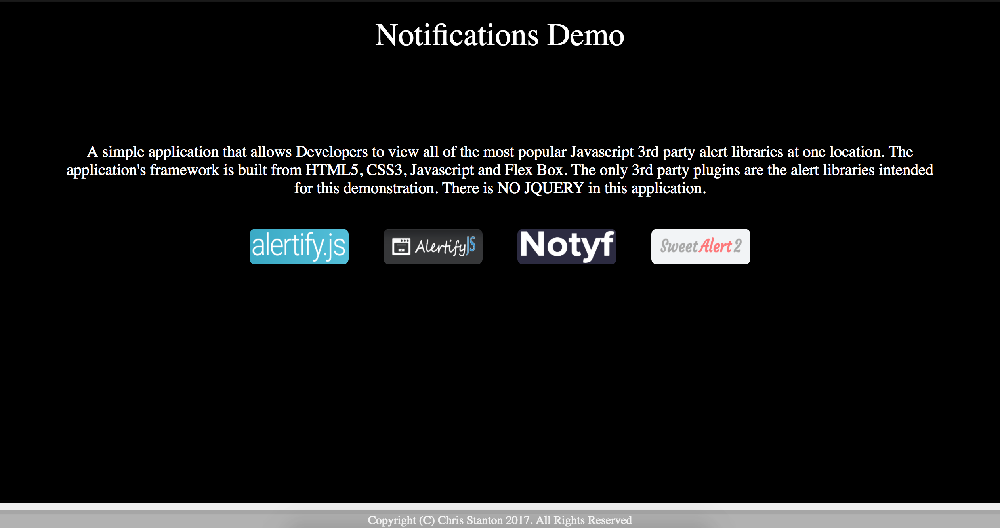
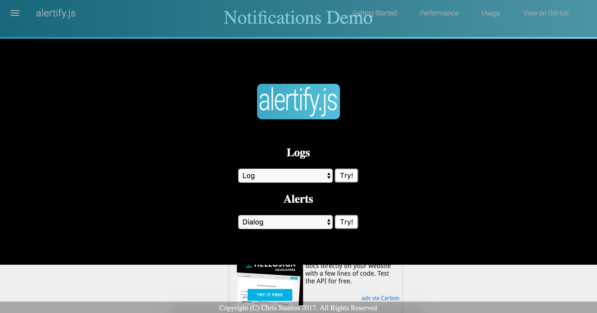
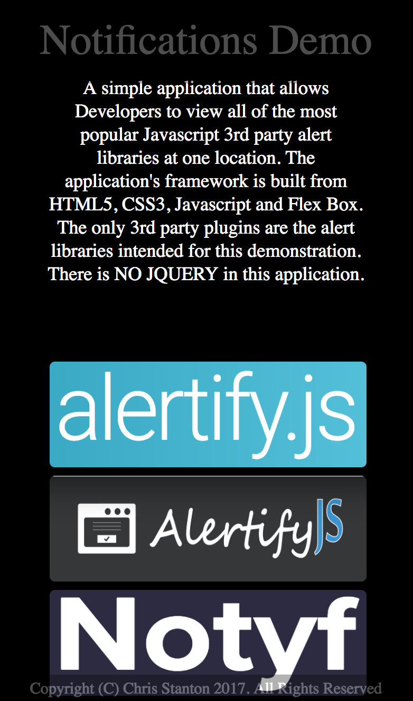
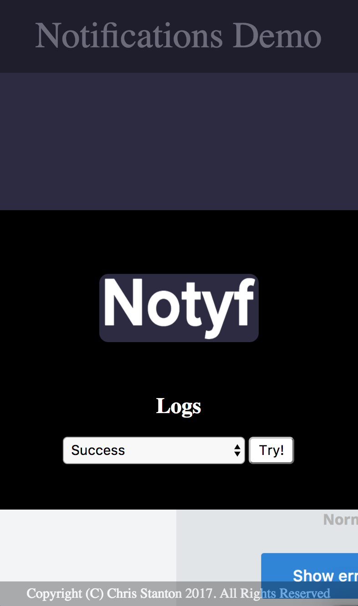

# Notifications Demo

---

## Description:

##### A simple application that allows Developers to view all of the most popular Javascript 3rd party alert libraries at one location.  The application's framework is built from HTML5, CSS3, Javascript, Flex Box and Waypoints.js. The only 3rd party plugins are the alert libraries intended for this demonstration.  There is NO JQUERY in this application. See the Technologies Used section below for libraries used.

###### Desktop views:

###### Mobile views:

---

## Technologies Used
  1. HTML5
  2. CSS5
  3. Javascript
  4. WaypointJS http://imakewebthings.com/waypoints/
  5. NotifyJS http://carlosroso.com/notyf/
  6. alertify.js https://alertifyjs.org/
  7. Alertify JS http://alertifyjs.com/
  8. SweetAlert 2 https://limonte.github.io/sweetalert2/

---  

## How To Install App
  1. Download zip file
  2. Open index.html file in browser

---

#### App can be viewed at: https://notifications-demo.herokuapp.com/

---

## License
##### Copyright 2017 Chris Stanton

###### Permission is hereby granted, free of charge, to any person obtaining a copy of this software and associated documentation files (the "Software"), to deal in the Software without restriction, including without limitation the rights to use, copy, modify, merge, publish, distribute, sublicense, and/or sell copies of the Software, and to permit persons to whom the Software is furnished to do so, subject to the following conditions:

###### The above copyright notice and this permission notice shall be included in all copies or substantial portions of the Software.

###### THE SOFTWARE IS PROVIDED "AS IS", WITHOUT WARRANTY OF ANY KIND, EXPRESS OR IMPLIED, INCLUDING BUT NOT LIMITED TO THE WARRANTIES OF MERCHANTABILITY, FITNESS FOR A PARTICULAR PURPOSE AND NONINFRINGEMENT. IN NO EVENT SHALL THE AUTHORS OR COPYRIGHT HOLDERS BE LIABLE FOR ANY CLAIM, DAMAGES OR OTHER LIABILITY, WHETHER IN AN ACTION OF CONTRACT, TORT OR OTHERWISE, ARISING FROM, OUT OF OR IN CONNECTION WITH THE SOFTWARE OR THE USE OR OTHER DEALINGS IN THE SOFTWARE.
